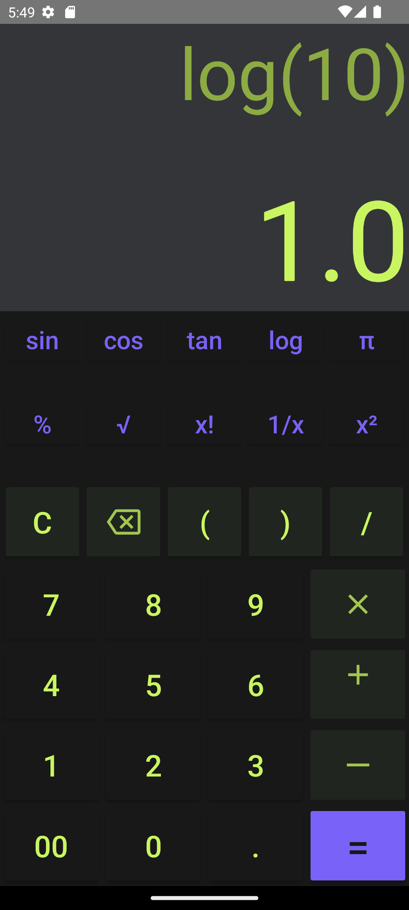

# Basic Scientific Calculator Android App
This is a simple scientific calculator Android application designed to perform basic arithmetic operations and some scientific functions.

## Features
1. Addition, subtraction, multiplication, and division operations.
2. Scientific functions such as square root, exponentiation, trigonometric functions (sine, cosine, tangent), and logarithmic functions.
3. User-friendly interface with large buttons for ease of use.
4.Clear button to erase the current input.

## Implementation Details
### OnClickListener Usage
The application utilizes the OnClickListener interface to handle button clicks efficiently. Each button representing a digit, operator, or function is assigned an OnClickListener to perform specific actions when pressed.

### Handling Button Clicks
When a button is clicked, the corresponding method is invoked to handle the input. For numeric buttons, the digits are appended to the expression displayed on the calculator screen. For operator buttons, the appropriate operator is added to the expression. For function buttons, the corresponding function is applied to the current expression.

## Screenshots
    

        
